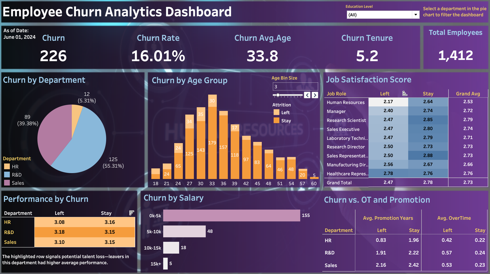
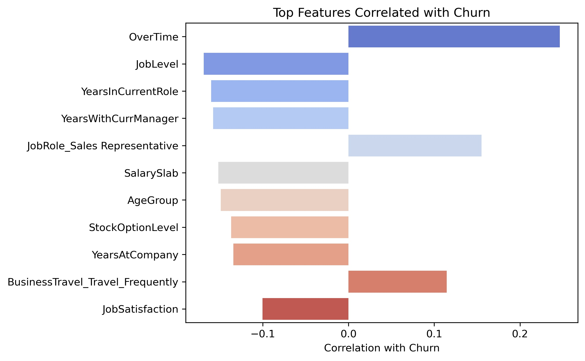

# Employee Churn Predictive Analytics Writeup
I built a data-driven solution that empowers HR teams to proactively flag and retain at-risk employees. Combining Python-based predictive modeling with a dynamic Tableau dashboard, this project identifies key churn drivers and enables timely, targeted intervention.
## Project Objectives
- Clean and process HR data to enable meaningful churn analysis and predictive modeling
- Analyze employee churn patterns and identify key contributing factors
- Uncover correlations related to performance and satisfaction metrics
- Develop an interactive Tableau dashboard to visualize employee churn distribution
- Provide actionable recommendations for HR to monitor employee well-being and reduce attrition
## Project Output
1.	Python Notebook: Explore the complete workflow in the [Churn_Analytics.ipynb](Churn_Analytics.ipynb) file, including:
- Data cleaning and preprocessing
- Correlation analysis to identify churn drivers
- Predictive modeling using logistic regression and other classifiers
2.	Tableau Dashboard: Interact with the [descriptive analysis dashboard](https://public.tableau.com/shared/DQSK678RN?:display_count=n&:origin=viz_share_link) on Tableau Public:
- Visualize churn distribution by department, age, performance and more
- Drill down into employee groups to uncover trends and insights
## Business Questions Answered
This analysis was designed to help HR leaders answer the following critical questions:
- What are the key contributing factors of voluntary turnover in this workforce?
- Which departments, job roles and age groups have the highest churn rates, and why?
- Can we identify at-risk employees early enough to intervene?
- Are we losing top performers?
- What employee groups are most vulnerable to churn?
The answers to these questions are discussed in the following sections through descriptive statistical analytics, correlation analysis and predictive analysis.
## Descriptive Statistical Analysis
I designed an [interactive Tableau dashboard](https://public.tableau.com/shared/DQSK678RN?:display_count=n&:origin=viz_share_link) to help HR monitor and explore descriptive churn statistics. The dashboard includes two key filters: a dropdown filter for education level, and a department-level filter triggered by selecting a segment of the pie chart. When a department is selected, all related metrics update dynamically to reflect the chosen segment.

### 1. Churn Rate Overview
As of June 2024, the overall churn rate is 16.01%. Average churn age is around 34 years old. Average churn tenure is around 5 years in the current company.
### 2. Churn Rate by Department
Sales department has the highest churn rates among all 3 departments. One possible reason is that Sales team has the higher average of work hour overtime and years since last promotion comparing with other departments.  
The R&D department accounts for the largest share of churned employees, which aligns with its position as the department with the highest overall headcount.
### 3. Churn by Age
Employees aged 26 to 35 account for the highest number of churn cases, which aligns with this age group also having the largest employee population. To provide better context and support comparison, I included a stacked bar chart that shows both churned and retained employees by age group.
### 4. Churn by Job Satisfaction
Overall, employees who left the company reported lower job satisfaction compared to those who stayed. Notably, job satisfaction among HR employees is significantly below the company average.
### 5. Performance Rating by Churn
It’s important to monitor whether the company is losing top performers. To address this, I included a pivot table showing the average performance rating by department and attrition status. Departments where the average rating of employees who left is higher than those who stayed are highlighted. Currently, the R&D department stands out as losing higher-performing talent.
## Exploratory Data Analysis
For early exploratory data analysis,  I conducted a correlation analysis to see what attributes affect churn. The top The top five attributes are:  
1.	OverTime – Employees working overtime are more likely to leave.
2.	Job Level – Lower-level employees tend to churn more.
3.	Years in Current Role – Shorter tenure in the current role correlates with higher churn.
4.	Years with Current Manager – Less time with a current manager increases the likelihood of leaving.
5.	Salary Slab – Lower salary bands are associated with higher turnover.

## Key Predicting Coefficients
Logistic regression coefficients are more reliable for understanding true feature importance. 
The top five coefficients are:
1. JobRole
2. BusinessTravel
3. EducationField
4. OverTime
5. MaritalStatus

## Predictive Analysis
To support proactive retention, I enabled early risk detection by developing a classification model that identifies high-risk employees with 98% recall. 
The table below compares the performance of four models. 
| Model               | Accuracy | Precision (Stay) | Precision (Leave) | Recall (Stay) | Recall (Leave) | F1-score (Leave) |
|---------------------|----------|------------------|----------------|-------------------|----------------|------------------|
| Logistic Regression | 0.85     | 0.65             | 0.87           | 0.29              | 0.97           | 0.91             |
| Random Forest       | 0.85     | 0.80             | 0.85           | 0.16              | 0.99           | 0.91             |
| XGBoost             | 0.86     | 0.73             | 0.87           | 0.31              | 0.98           | 0.92             |
| Gradient Boosting   | 0.86      | 0.75              | 0.87            | 0.31               | 0.98            | 0.92              |

XGBoost achieved the best performance of identifing leavers without the less false alarm, making it the most reliable model for identifying employees who are likely to churn.  
## Recommendations
HR teams can use the predictive model as a risk-flagging system, in conjunction with the Tableau dashboard, to monitor high-risk segments and take targeted actions before attrition occurs. According to the correlation analysis, I suggest HR to focus on the following 5 points:  
1. Monitor Overtime Patterns  
Excessive overtime is a strong churn indicator. HR should track and manage employee workloads, ensuring a healthy work-life balance. Consider policies to reduce mandatory overtime or provide compensation and support for high-demand periods.

2. Support Early-career Employees  
Lower-level employees are more likely to leave. This suggests the need for clearer growth paths, onboarding support, and mentorship programs to engage and retain junior staff.

3. Invest in Internal Mobility  
Short tenure in current roles often leads to churn. Encouraging job rotation or internal promotions may help employees feel more challenged and valued.

4. Strengthen Manager-employee Relations  
Employees with limited time under a current manager are more likely to churn. HR can invest in leadership training and onboarding programs for managers to help build trust and rapport early on.  

5. Review Compensation Strategy  
Lower salary is associated with higher attrition. Benchmarking compensation against industry standards and ensuring fairness can help retain valuable talent—especially in competitive roles.
## Source Datasets Description
The employee_info dataset is a cross-sectional table containing 1480 employee’s data and 37 features including age, attrition, department, satisfaction, etc.. To simulate the imperfections of real-world business data, I intentionally introduced random null values to reflect common data quality issues encountered in practice.  

Key features at a glance:
| Column Name              | Description                                               |
|--------------------------|-----------------------------------------------------------|
| Emp ID                   | Unique employee identifier                                |
| Age Group                | Employee age grouped into 5 bands (18–55)                 |
| Attrition                | Indicates if the employee has left the company (Yes/No)  |
| Department               | Employee’s department                                     |
| Education                | Education level (1=HS, 2=Associate, 3=Bachelor, etc.)     |
| Gender                   | Gender of the employee (Male/Female)                      |
| JobSatisfaction          | Satisfaction rating (1 = low, 5 = high)                   |
| NumCompaniesWorked       | Number of prior employers                                 |
| OverTime                 | Whether the employee has worked overtime (Yes/No)         |
| YearsAtCompany           | Total tenure at the company (in years)                    |
| YearsSinceLastPromotion  | Years since the last promotion                            |
## Data Preparation
### 1. Data Cleaning
To ensure reliable analysis, I began data cleaning by removing irrelevant or redundant features. For example, columns with only one unique value (e.g., "Over18" which contains only "Y"), and salary-related columns such as 'DailyRate', 'HourlyRate', 'MonthlyRate', and 'MonthlyIncome' were excluded in favor of a consolidated "SalarySlab" feature. This helped reduce noise and multicollinearity.  

I addressed data duplication by removing identical records to maintain dataset integrity.  

For missing values, I assessed their frequency and importance. Since fewer than 5% of the rows had missing data, and each affected column had only one null, I considered dropping them. However, to retain more information—recognizing HR might prefer not to lose any data—I opted to impute values using statistical measures (mean, median, or mode), depending on the skewness of each column.  

Finally, I verified the consistency of categorical variables to avoid issues during encoding or grouping. I checked for inconsistencies in formatting (e.g., "Yes" vs "yes") and confirmed that the dataset contained no such discrepancies.
### 2. Data Processing
To prepare the data for machine learning, I converted all features into numeric format. I applied ordinal encoding for ranked features like salary level, binary encoding for yes/no fields like “OverTime”, and one-hot encoding for nominal categories to avoid multicollinearity. This ensured compatibility with scikit-learn models while preserving interpretability.
## Conclusion
This project demonstrates my ability to turn messy HR data into actionable business insights using Python, SQL, and Tableau. By identifying at-risk employees early, HR teams can prioritize interventions, reduce voluntary turnover, and retain top talent—transforming raw data into strategic advantage.

